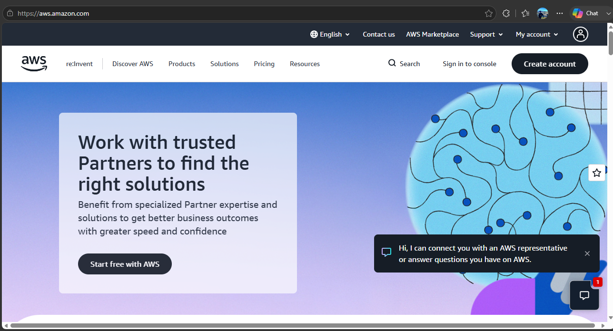

# AWS Research

## 1. Brief Overview

Amazon Web Services (AWS) is a cloud computing platform that provides a wide range of on-demand cloud services. These services include computing, storage, databases, networking, security, analytics, and artificial intelligence. AWS launched its cloud infrastructure services in 2006 and uses a pay-as-you-go model, allowing organizations to access computing resources without purchasing and maintaining all physical infrastructure themselves.

## 2. Global Infrastructure

AWS Global Infrastructure is built around Regions and Availability Zones. An AWS Region is a separate geographic area that contains multiple Availability Zones. Availability Zones are isolated locations within a Region, and each consists of one or more data centers with redundant power, networking, and connectivity.

This infrastructure helps organizations build applications that are highly available, fault tolerant, and scalable. AWS also provides Local Zones and Wavelength Zones for applications that need resources closer to end users or very low latency for 5G applications.

## 3. Cloud Management Console

The AWS Management Console is a web-based application that provides centralized access to AWS services. It allows users to search for and open individual AWS service consoles, manage AWS resources, view notifications, access account and billing information, and configure console settings.

The AWS Console Home serves as the main page of the AWS Management Console. From this page, users can access AWS services and manage their cloud resources through a unified web interface.

## 4. Four Core Services

### Amazon EC2

Amazon Elastic Compute Cloud (Amazon EC2) is an AWS service that provides on-demand and scalable computing capacity through virtual servers in the cloud. An EC2 instance is a virtual server that can be configured with different amounts of computing power, memory, storage, and networking resources depending on the needs of an application.

EC2 allows organizations to launch, configure, and manage virtual servers without purchasing physical hardware. It can also scale computing capacity up or down as workload requirements change, making it suitable for web applications, enterprise applications, high-performance computing, and other workloads.

### Amazon S3

Amazon Simple Storage Service (Amazon S3) is an object storage service that allows users to store, manage, and retrieve data in the AWS Cloud. S3 stores data as objects inside containers called buckets, and each object can contain a file and its associated metadata.

Amazon S3 is designed for scalability, data availability, security, and performance. It can be used for many purposes, including storing website files, mobile application data, backups, archives, data lakes, and data used for analytics and artificial intelligence.

### Amazon VPC

Amazon Virtual Private Cloud (Amazon VPC) is a networking service that allows users to create a logically isolated virtual network within the AWS Cloud. It provides control over the network environment, including IP address ranges, subnets, route tables, and network gateways.

Amazon VPC allows organizations to organize and connect their AWS resources in a controlled network environment. It can be used to connect resources to the internet, other VPCs, or an organization's on-premises network while providing networking and security configuration options.

### AWS IAM

AWS Identity and Access Management (IAM) is a service that helps organizations securely control access to AWS resources. IAM allows administrators to manage users, groups, roles, and permissions that determine which AWS resources can be accessed and what actions can be performed.

IAM supports security by following the principle of granting users and applications only the permissions they need. It is commonly used to manage authentication and authorization for AWS resources and services.

## 5. Three Advantages

### 1. Scalability

AWS allows organizations to increase or decrease cloud resources based on their workload requirements. This helps businesses handle changing demand without having to purchase additional physical infrastructure.

### 2. Global Infrastructure

AWS provides a global infrastructure consisting of Regions and Availability Zones. This allows organizations to deploy applications closer to their users and design systems for high availability and fault tolerance.

### 3. Wide Range of Cloud Services

AWS provides a large collection of cloud services covering areas such as computing, storage, networking, databases, security, analytics, and artificial intelligence. Organizations can combine different services to build solutions that match their specific requirements.

## 6. Typical Enterprise Use Cases

AWS can be used by enterprises for a variety of workloads and business requirements. Common use cases include hosting websites and web applications, storing and backing up business data, running enterprise applications, developing and deploying software, building data lakes, performing analytics, and supporting artificial intelligence and machine learning workloads.

AWS can also support disaster recovery and highly available applications by allowing organizations to distribute resources across different Availability Zones and Regions.

## 7. Screenshot

