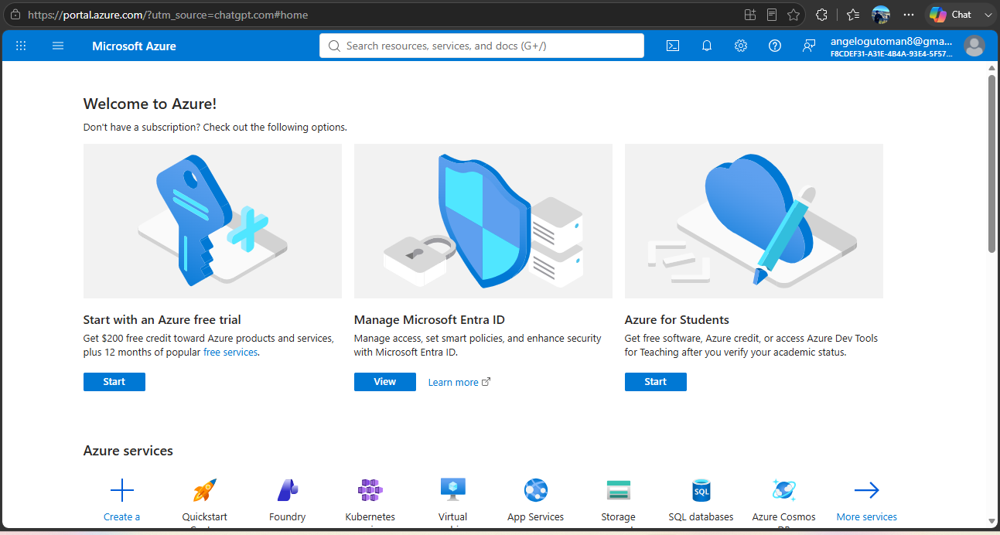

# Microsoft Azure Research

## 1. Brief Overview

Microsoft Azure is a cloud computing platform developed by Microsoft that provides a wide range of cloud services for organizations, developers, and businesses. Azure provides services for computing, storage, networking, databases, security, analytics, artificial intelligence, application development, and other cloud workloads.

Azure allows organizations to use computing resources and services through the cloud without having to purchase and maintain all of the required physical infrastructure themselves. Its services support different deployment models and workloads, including web applications, enterprise systems, data platforms, artificial intelligence, and hybrid cloud environments.

Azure is also strongly integrated with Microsoft's technology ecosystem. This makes it particularly useful for organizations that already use technologies such as Windows Server, Microsoft 365, Active Directory, and other Microsoft enterprise products.

---

## 2. Global Infrastructure

Microsoft Azure operates a global cloud infrastructure consisting of geographic regions, datacenters, networking infrastructure, and Availability Zones. Azure currently provides more than 70 regions around the world, allowing organizations to select locations based on factors such as latency, data residency, compliance, and application requirements.

An Azure region is a geographic area containing physical datacenters and networking infrastructure. Many Azure regions provide Availability Zones, which are physically separate groups of datacenters within a region. Each Availability Zone has independent power, cooling, and networking infrastructure, helping applications remain available when a localized datacenter or infrastructure failure occurs.

Azure also provides regional resiliency options, including the use of multiple regions and, where applicable, paired regions. Organizations can use these capabilities to improve availability, disaster recovery, and business continuity.

---

## 3. Cloud Management Console

The Azure portal is a web-based, unified management console used to create, manage, monitor, and configure Azure resources. It provides a graphical user interface that allows users to work with services such as virtual machines, databases, storage accounts, networking resources, and application services.

The Azure portal provides a centralized environment where users can search for services, create new resources, manage existing resources, monitor deployments, and review subscription-related information. It also provides dashboards and tools that help administrators monitor and manage their cloud environment.

The portal can be accessed through a supported web browser, making it possible for administrators and developers to manage Azure resources without installing a dedicated desktop management application.

---

## 4. Four Core Services

### Azure Virtual Machines

Azure Virtual Machines (VMs) provide scalable computing resources in the cloud. A virtual machine allows organizations to run Windows or Linux operating systems without purchasing and maintaining a physical server.

Organizations can configure virtual machines based on their computing requirements, including processor capacity, memory, storage, and networking. Azure Virtual Machines can be deployed across Availability Zones and can also work with Virtual Machine Scale Sets to support high availability and automatic scaling.

Common uses include hosting websites, enterprise applications, development environments, databases, and migrated on-premises workloads.

### Azure Blob Storage

Azure Blob Storage is Microsoft's object storage service for storing large amounts of unstructured data in the cloud. It can store files and other types of data such as documents, images, videos, backups, logs, and application data.

Blob Storage is designed to support scalable storage requirements and can be used for applications such as data backup, content storage, data lakes, and application file storage. It provides different storage tiers that can help organizations manage data according to access frequency and cost requirements.

### Azure Virtual Network

Azure Virtual Network (VNet) is a networking service that allows organizations to create private networks within Azure. It provides a way for Azure resources such as virtual machines and applications to communicate with each other securely.

A Virtual Network can be configured using components such as subnets, IP address ranges, routing, and network security controls. VNets can also be connected to on-premises networks, allowing organizations to create hybrid cloud environments.

### Microsoft Entra ID

Microsoft Entra ID is Microsoft's cloud-based identity and access management service. It helps organizations manage identities and control access to applications, services, and resources.

Entra ID can be used for authentication and authorization, allowing administrators to control which users and applications can access specific resources. It is especially valuable for organizations that use Microsoft's cloud and enterprise ecosystem because it supports centralized identity management and access control.

---

## 5. Three Advantages

### 1. Strong Microsoft Ecosystem Integration

One of Azure's major advantages is its integration with Microsoft's existing technologies and services. Organizations that already use Windows Server, Microsoft 365, Active Directory, and other Microsoft technologies can integrate these environments with Azure.

### 2. Global Infrastructure and Availability

Azure provides a large global infrastructure with regions and Availability Zones that can help organizations deploy applications closer to users and design systems for resilience. Organizations can select regions based on requirements such as latency, data residency, compliance, and availability.

### 3. Wide Range of Enterprise Services

Azure provides a broad collection of services covering computing, storage, networking, databases, security, analytics, artificial intelligence, application development, and other workloads. This allows organizations to build and migrate different types of applications using services from a single cloud platform.

---

## 6. Typical Enterprise Use Cases

Microsoft Azure is commonly used by enterprises for application hosting, infrastructure migration, data storage, database systems, software development, analytics, artificial intelligence, and hybrid cloud environments.

Organizations can migrate existing Windows Server workloads to Azure Virtual Machines while using Azure networking and identity services to connect and secure their resources. Azure can also support modern application development using managed application and container services.

Azure is particularly suitable for organizations that already depend heavily on Microsoft technologies. Universities, government organizations, financial institutions, healthcare organizations, and large enterprises can use Azure to modernize existing infrastructure while maintaining integration with their existing Microsoft environment.

---

## 7. Screenshot

