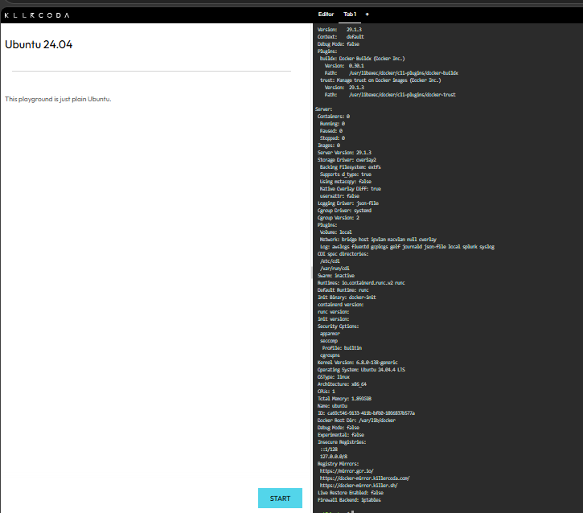
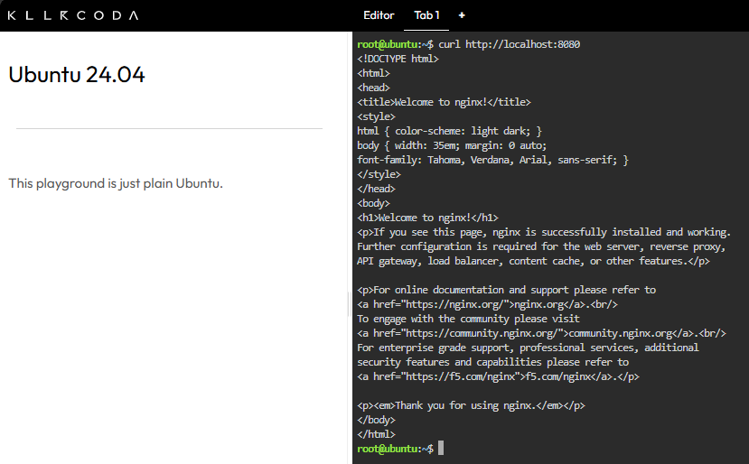
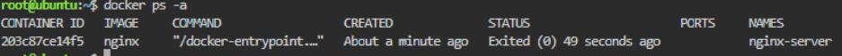

# Laboratory 04 – Cloud-Native Engineer

**Name:** Angelo Gutoman  
**Course & Section:** BSIT 4-L

## Mission Overview

This laboratory activity focuses on understanding the difference between traditional Virtual Machines and Containers. It also introduces Docker commands and the deployment of an Nginx web server using a container.

## Objectives

- Understand the differences between Virtual Machines and Containers.
- Access and use a Docker-enabled environment.
- Execute basic Docker commands.
- Pull, run, manage, and terminate an Nginx container.
- Document container operations using Markdown.
- Continue developing my GitHub Cloud Computing Portfolio.

## Docker Commands Executed

### Verify Docker

The following commands were used to verify that Docker is installed and running:

    docker --version
    docker info

### Pull the Nginx Image

    docker pull nginx

### Run the Nginx Container

    docker run -d -p 8080:80 --name nginx-server nginx

### Test Nginx

    curl http://localhost:8080

The command successfully displayed the Nginx welcome page.

### Container Lifecycle

    docker ps
    docker stop nginx-server
    docker ps -a
    docker rm nginx-server

## Skills Learned

I learned how to compare Virtual Machines and Containers, use basic Docker commands, deploy an Nginx container, and manage the container lifecycle. I also learned how to document my Docker activities using Markdown and organize screenshots as evidence in my GitHub portfolio.

## Challenges Encountered

One challenge I encountered was that the KillerCoda environment was refreshed, which caused the Docker container to disappear. I learned that the playground environment is temporary and that containers may need to be recreated after a refresh. I was able to solve this by running the Docker commands again and verifying the container status.

## Mission Reflection
This laboratory helped me understand how Docker containers are different from traditional Virtual Machines. A Docker container can start much faster because it does not need to boot a complete operating system like a Virtual Machine. Instead, containers share the host operating system, which makes them more lightweight and efficient. This makes container deployment faster and more practical for web applications.

My reflection about the laboratory activity is documented in the `reflection.md` file.
